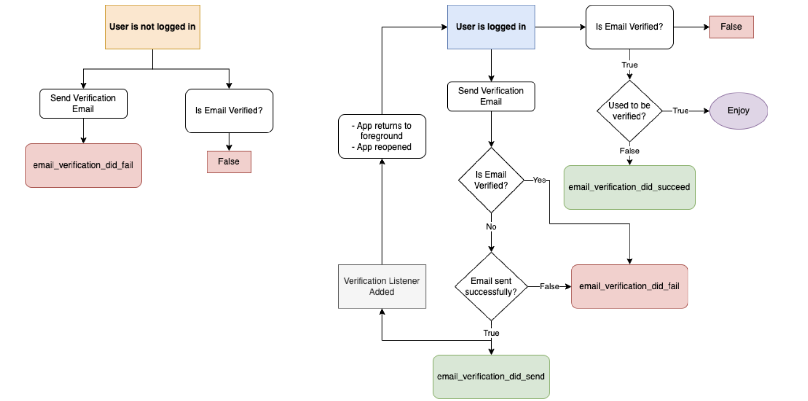
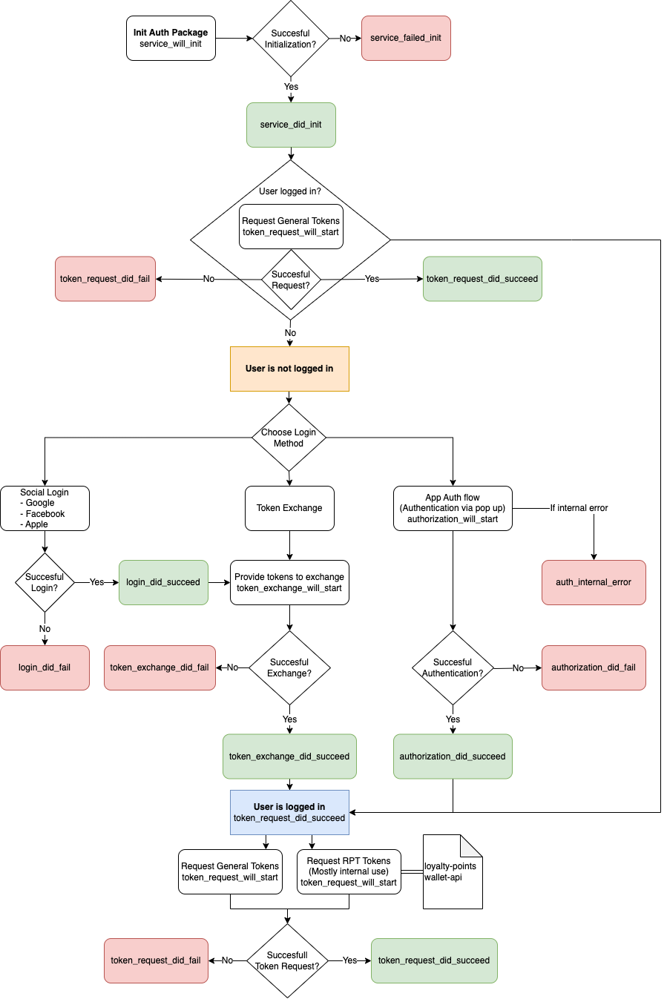

# tpsdk-unity-auth

This package provides an easy way to identify your users in a secure and reliable way from your Unity Project. It's built on top of [AppAuth](https://github.com/openid/AppAuth-Android) for OAuth 2.0 and OpenID compatibility and [Microsoft Identity Model](https://learn.microsoft.com/en-us/dotnet/api/system.identitymodel.tokens.jwt) libraries for token validation.

---
## Configuration

To configure the package, [import it into your project](https://docs.unity3d.com/Manual/upm-ui-local.html) and create a configuration file by clicking on the top menu TiltingPoint > Auth > Configuration. 
  * For **Android**, set up your project dependencies by clicking TiltingPoint > Auth > Android dependencies.

---
## Usage

Once you've set up the configuration file, you can start using the Auth Package by interacting with the `Authenticator` class. The following methods allow you to interact with the package:
* `Authenticator.Initialize()` Initializes the package and pulls the server configuration. Two events will inform you about the result of this action: `Authenticator.OnInitDidSucceed` and `Authenticator.OnInitDidFail`.
* `Authenticator.TokenExchange()` Performs a token exchange request with an external issuer. Two events will inform you about the result of this action `Authenticator.OnTokenExchangeDidSucceed` and `Authenticator.OnTokenExchangeDidFail`.  The succeed event will return the id, access and refresh tokens.
* `Authenticator.TokenRequest()` Returns a set of fresh tokens from the user. We strongly recommend to not to cache any of your tokens and use this function to make sure you are always using valid tokens. Two events will inform about the result of this action `Authenticator.OnTokenRequestDidSucceed` and `Authenticator.OnTokenRequestDidFail`.  The succeed event will return the id, access and refresh tokens.
  
  * **Note**: `TokenRequest` will only work after the user has been authorized via `Authorize()` or `TokenExchange()`.
    If you need an RPT Token for a specify it as the first parameter of the TokenRequest call.
    For an implementation example, see the `SampleScene.unity` and `AuthSampleRunner.cs contained inside the Auth Package

---
## Token Utilities

The Auth package provides some utilities to help you work with tokens:

* `AuthUtils.ValidateToken()` Validates a token. **Note**: All ID tokens provided by the Auth package are already validated.
* `AuthUtils.GetTokenClaim()` Tries to get a claim from a JWT token.
* `AuthUtils.GetTokenClaims()` Gets the claims list from a JWT token.
* `AuthUtils.GetTokenHandler()` Returns a JwtSecurityToken from a JWT token.
* `AuthUtils.GetTokenExpirationDate()` Returns the expiration date from a JWT token.

`TokenResponse` & `TokenResponseHandler`. TokenResponse is the default structure that contains the raw tokens given by the Auth Package. If access to the internal information is needed TokenResponseHandler will provide some useful accessors. Example:

```c#
var handler = new TokenResponseHandler(response);
var idToken = handler.idToken;
Log($"Id Token details:\n" +
$"- Expiration: {idToken.TokenExpirationDate}\n" +
$"- jti: {idToken.Id}\n" +
$"- Email verified: {idToken.EmailVerified}\n" +
$"- TP User Id: {idToken.TpUserId}\n");
```

---
## External Login Adapters

The Auth package can hook to external login providers like Google or Apple and perform a token exchange after a successful login.
Custom Login Adapters can be created by inheriting from `BaseLogin`

All adapters will inform you about a successful login using two events: `Authenticator.OnLoginDidSucceed` and `Auth.OnLoginDidFail`, they will provide you only with the information given by the chosen Login Provider.

After a successful login, a Token Exchange will get performed automatically and trigger `Authenticator.OnTokenExchangeDidSucceed` or `Authenticator.OnTokenExchangeDidFail` events.

---
## Email Verification
Some external services may require the user email to be verified. You can call to know the state of the user email verification and start the verification process.

* `Authenticator.IsCachedUserEmailVerified` Checks if the stored user credentials have the email verified.

* `Authenticator.IsUserEmailVerified` Will force the refresh of your local tokens and check if the user email is verified. To avoid server overloading `IsCachedUserEmailVerified` is recommended.

* `Authenticator.SendVerificationEmail` Will send an email to the user for email verification.


These are the events you can subscribe to know whats the state of the verification.

* `Authenticator.OnEmailVerificationDidSend` Triggered when the email has been successfully sent.

* `Authenticator.OnEmailVerificationDidSucceed` Triggered when the user email status changes to verified, meaning that it has completed the verification process correctly. 

  * **Important note**: This event will only get triggered when the app is opened, when coming from background after `SendVerificationEmail`, after forcing a token request via `IsUserEmailVerified` or `TokenRequest(true)`. With this information in mind, a good practice to avoid users getting stuck in the process if they use another device to confirm the email, is to add a button that calls `IsUserEmailVerified` that the user can interact with if they have used an external device for the confirmation.

`Authenticator.OnEmailVerificationDidFail` Triggered when something went wrong sending the verification email.



---
### Event Flow Diagram


## Important notes
This package was developed for internal use within the __Tilting Point SDK__ and __Tilting Point Services__ and is not recommended for production usage due to the use of Debug libraries and non-secure token storage.

___

Copyright © 2023 Tilting Point Media

Created by Jonatan Sempere Mañas.

Permission is hereby granted, free of charge, to any person obtaining a copy of this software and associated
documentation files (the “Software”), to deal in the Software without restriction, including without limitation the
rights to use, copy, modify, merge, publish, distribute, sublicense, and/or sell copies of the Software, and to
permit persons to whom the Software is furnished to do so, subject to the following conditions:

The above copyright notice and this permission notice shall be included in all copies or substantial portions
of the Software.

THE SOFTWARE IS PROVIDED “AS IS”, WITHOUT WARRANTY OF ANY KIND, EXPRESS OR IMPLIED, INCLUDING BUT NOT LIMITED TO
THE WARRANTIES OF MERCHANTABILITY, FITNESS FOR A PARTICULAR PURPOSE AND NONINFRINGEMENT. IN NO EVENT SHALL THE
AUTHORS OR COPYRIGHT HOLDERS BE LIABLE FOR ANY CLAIM, DAMAGES OR OTHER LIABILITY, WHETHER IN AN ACTION OF CONTRACT,
TORT OR OTHERWISE, ARISING FROM, OUT OF OR IN CONNECTION WITH THE SOFTWARE OR THE USE OR OTHER DEALINGS IN
THE SOFTWARE.